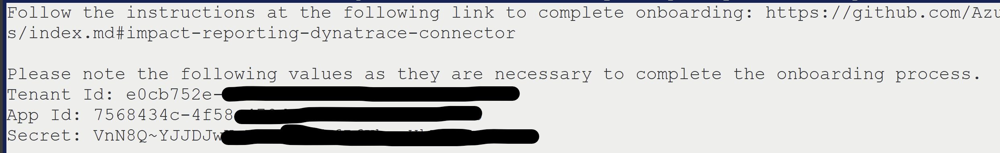

# Troubleshooting

## Onboarding To AzureImpactReporting on Dynatrace
 
### Step 1 - Azure Entra App Configuration
 
Use the values mentioned in the result of onboarding script for Tenant Id, App Id and Secret respectively.

 
#### AADSTS90002: Tenant not found
1. Make sure that the tenant Id entered matches with the tenant Id present in the result of onboarding script.
2. Find your tenant in Microsoft Entra Id [here](https://learn.microsoft.com/en-us/azure/active-directory/fundamentals/active-directory-how-to-find-tenant).
2. Ensure that there are active subscription(s) for the tenant.
 
#### AADSTS90002: Application not found
Ensure that the entered app id is correct and present under app registrations of Microsoft Entra Id. [Click to find list of app registrations in your tenant](https://ms.portal.azure.com/#view/Microsoft_AAD_IAM/ActiveDirectoryMenuBlade/~/RegisteredApps)
 
#### ADSTS7000215: Invalid client secret provided
1. Ensure the secret used for onboarding matches with the secret provided by the onboarding script.
2. If you didn't consent to secret creation while running the onboarding script, create the secret first. ([How to create a secret?](https://learn.microsoft.com/en-us/entra/identity-platform/quickstart-register-app?tabs=client-secret))
 
#### No Onboarded Subscriptions or Few Onboarded Subscriptions
1. Onboarding script has to be run on all the subscriptions you are trying to onboard.
2. 'Impact Reporter' and 'Monitoring Reader' roles should be present on the app for all the subscriptions you are trying to onboard
 
### Step 2: Workflow Creation
#### Cannot create a new workflow
1. This error occurs when the limit for total amount of workflows that can be created in an account is reached.
2. Try deleting a workflow and then onboarding.
3. Work with the dynatrace team to increase the limit for your account.

## Work Execution failure and Insights Page failure

### Error: No app settings found
1. Head over to the app settings for "Impact Reporting Connector Dynatrace" app.
2. Ensure that app settings are present with appropriate values for Tenant Id, Credential Vault Secret Id and Onboarding Status

### Error: AADSTS700016 - Application not found
1. Find the application Id from error message. Validate that this app is listed in Microsoft Entra Id. ([Click to find list of app registrations in your tenant](https://ms.portal.azure.com/#view/Microsoft_AAD_IAM/ActiveDirectoryMenuBlade/~/RegisteredApps))
2. Note the tenant id from the workflow logs. 
    - Log is of the format: "Tenant Id is: XXXX"
    - Ensure that the Tenant Id matches the tenant for which the problem is triggered i.e, Tenant Id in which the affected resource is present.
    - Contact support if it doesn't match.

### Error: AADSTS7000215 - Invalid client secret
1. Note the secret id from the workflow logs. This is same as the credential vault secret id and of the format "CREDENTIALS_VAULT-XXXXXXXX".
    - Go to Credential vault app in dynatrace
    - Ensure that credential with id noted in first step is present in the credential vault app.
2. Find the app id from the workflow logs.
    - The log mentioning app id is similar to "Fetching access token with Entra App Id: XXXXXXXXX
    - This App Id corresponds to DynatraceImpactReportingConnectorApp under app registrations in Microsoft Entra Id if the onboarding script is used without passing a custom app id.
    - If custom app id is passed to the onboarding script, the app id mentioned in the logs exactly matches with the custom app id that was passed.
    - Create a secret for this app id. ([How to create a secret?](https://learn.microsoft.com/en-us/entra/identity-platform/quickstart-register-app?tabs=client-secret))
    - Note the secret and client id of the app registration. (Note: client id is same as app id).
    - Find the credential in credential vault as mentioned in step 1.
    - Overwrite the credential passing client id under user name and secret under password.
    - Save the credential.

### Error: Blocked Request (Host not in allowlist)
1. Dyntrace blocks all external calls by default.
2. To allow authentication and impact reporting, the follow URLs have to be allow-listed.
    - login.microsoftonline.com
    - management.azure.com
3. Search "Limit outbound connections" on dynatrace. Add the above URLs to the list of allowed hosts.

### Error: InsufficientPermission: NOT_AUTHORIZED_FOR_TABLE
1. In the Workflows app, at the top right corner, find Settings.
2. Click on Settings and then Authorization Settings.
3. Under Secondary permissions, select permissions for 'environment-api'.
4. Save changes and re-run the failed execution(s)

### Insights Page: Request Timeout
1. This means the external call to fetch insights took too long to return results.
2. Use the Refresh button on top of the table to attempt fetching insights again.

### Insights Page: Failed to fetch impacts insights
1. Use the Refresh button on top of the table to attempt fetching insights again.
2. If the issue persists, check the console logs to get a detailed error message. (Press F2 and then Click on Console)
3. Use the error message to see if it matches with any of the above mentioned errors.
