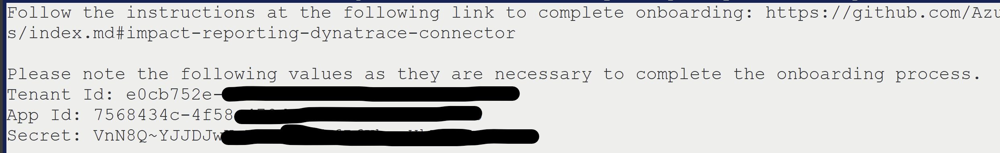

# Onboarding To AzureImpactReporting on Dynatrace - TSG
 
## Step 1 - Azure Entra App Configuration
 
Use the values mentioned in the result of onboarding script for Tenant Id, App Id and Secret respectively.

 
### AADSTS90002: Tenant not found
1. Make sure that the tenant Id entered matches with the tenant Id present in the result of onboarding script.
2. Find your tenant in Microsoft Entra Id [here](https://learn.microsoft.com/en-us/azure/active-directory/fundamentals/active-directory-how-to-find-tenant).
2. Ensure that there are active subscription(s) for the tenant.
 
### AADSTS90002: Application not found
Ensure that the entered app id is correct and present under app registrations of Microsoft Entra Id. [Click to find list of app registrations in your tenant](https://ms.portal.azure.com/#view/Microsoft_AAD_IAM/ActiveDirectoryMenuBlade/~/RegisteredApps)
 
### ADSTS7000215: Invalid client secret provided
1. Ensure the secret used for onboarding matches with the secret provided by the onboarding script.
2. If you didn't consent to secret creation while running the onboarding script, create the secret first. ([How to create a secret?](https://learn.microsoft.com/en-us/entra/identity-platform/quickstart-register-app?tabs=client-secret))
 
### No Onboarded Subscriptions or Few Onboarded Subscriptions
1. Onboarding script has to be run on all the subscriptions you are trying to onboard.
2. 'Impact Reporter' and 'Monitoring Reader' roles should be present on the app for all the subscriptions you are trying to onboard
 
## Step 2: Workflow Creation
### Cannot create a new workflow
1. This error occurs when the limit for total amount of workflows that can be created in a account is reached.
2. Try deleting a workflow and then onboarding.
3. Work with the dynatrace team to increase the limit for your account.