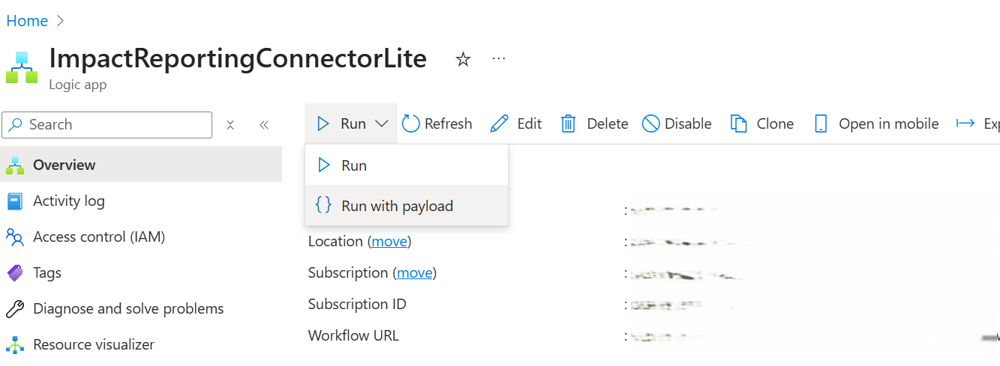
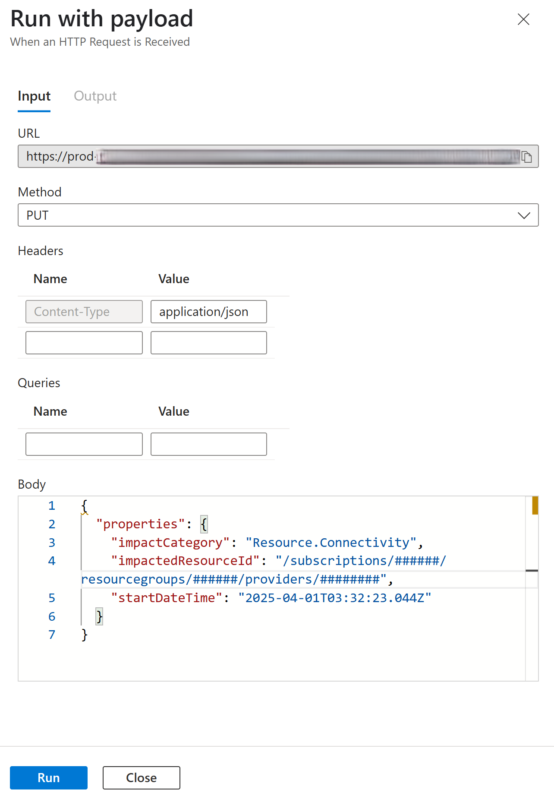

Readme.md -->
# Report Impacts Using a Webhook-Based Logic App

Deploy the logic app to your Azure subscription by clicking the button below.

## Prerequisites for ARM Template Deployment

The logic app requires the following input parameters:

1.  **Region:** The Azure region where the logic app will be deployed. This field is automatically populated with the location of the selected resource group. If you are creating a new resource group, select the desired region from the dropdown menu.
2.  **Logic App Name:** The default name is ImpactReportingConnectorLite. You can customize this name as needed.
3.  **Managed Identity Name:** The name of the User Assigned Managed Identity resource.
4.  **Managed Identity Subscription ID:** The subscription ID where the managed identity is created.
5.  **Managed Identity Resource Group:** The resource group where the managed identity is created.

## Logic App Functionality

-   This logic app functions as a REST client for reporting impacts.
-   It serves as a wrapper for the Impact Reporting REST API, streamlining the process of reporting impacts by simplifying authentication.
-   A User Assigned Managed Identity (UAMI) is used for secure authentication for reporting impacts.
-   The logic app enables reporting impacts across all subscriptions to which the UAMI has access.
-   The UAMI requires the Impact Reporter role to report impacts against a subscription.

## Triggering the Logic App

### 1. Triggering from the Azure Portal

-   Navigate to the logic app resource in the Azure portal.
-   Select **Run** -> **Run with payload**.
    
-   A panel will appear on the right.
-   Construct the impact payload in JSON format and click **Run** to report the impact.
    
-   Monitor the run history on the logic app's overview page.

### 2. Triggering from a REST Client

-   Alternatively, trigger the logic app from a REST client of your choice.
-   Copy the workflow URL from the logic app overview page.
-   Make a PUT request to this URL, including the impact payload in the request body (JSON format).
-   Monitor the run history on the logic app's overview page.

For comprehensive API details, refer to the Workload Impacts API Reference: [Workload Impacts API Reference](https://learn.microsoft.com/en-us/rest/api/impact/workload-impacts/create?view=rest-impact-2024-05-01-preview&tabs=HTTP)