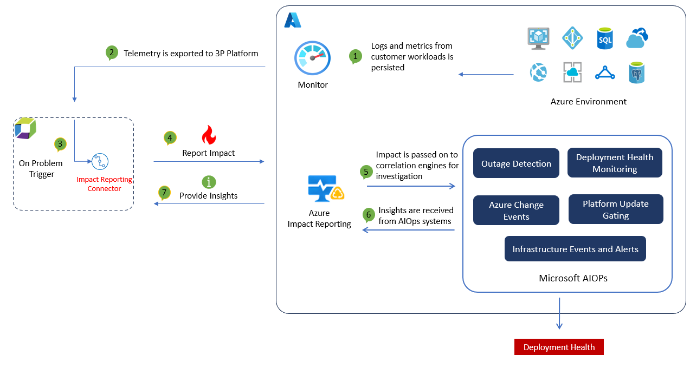

# Welcome to the Azure Impact Reporting app for Dynatrace Documentation

Welcome to the official documentation for Azure Impact Reporting app for Dynatrace! This guide will help you get started, answer common questions, and troubleshoot any issues. Whether you're a new user or an experienced customer, you'll find everything you need here.

## Azure Impact Reporting App for Dynatrace
This app will allow Azure - Dynatrace customers to seemlessly send their problem - alerts from their Dynatrace tenant to Impact Reporting. In return, Azure Impact Reporting will provide valuable insights directly back to Dynatrace, accessible through their hub. This reciprocal exchange will empower users with deeper insights and a streamlined problem resolution process. 

### How it works

This integration is based on the Impact Reporting app that will be uploaded and installed in customer's Dynatrace environment. On onboarding, the user will need to provide the list of Azure subscriptions that they would want to report an impact against, on behalf of their Azure Entra App. To note, this a 1: N relation, which means, a single app ID can be used for multiple subscriptions.(details below on the onboarding script and installation). Once the customer successfully installs the app and onboards to our program, impacts would be sent to Impact Reporting using a secure pipeline. Impact Reporting would receive an impact whenever a problem is triggered by DavisAI in Dynatrace. On the creation of the problem, Impact Reporting App would fetch required details from GRAIL, translate the problem into an impact and report it to Impact Reporting by making an authenticated REST call to ARM using a token generated by app details provided by customers during onboarding.

Impact Reporting would consume these impacts reported by the app and feed it into multiple internal intelligent systems to correlate and provide insights back to the user. These insights will then be found on the users Dynatrace environment, by the home page of the app. 

Important: This feature is in Private Preview. Visit here to review terms: https://azure.microsoft.com/en-us/support/legal/preview-supplemental-terms/

## Table of Contents

Various aspects of our documentation can be found in the below links:

1. [Onboarding Guide](./onboarding.md)
2. [Frequently Asked Questions (FAQ)](./faq.md)
3. [Troubleshooting Guide](./troubleshooting.md)

   
