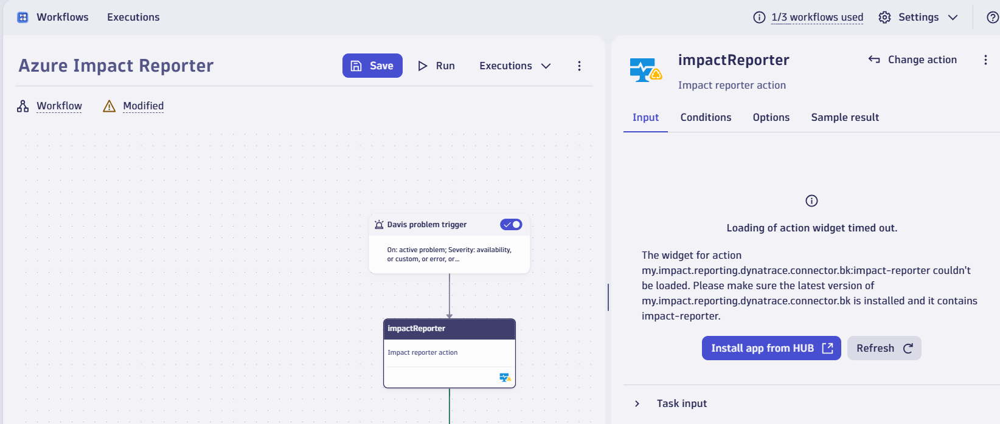

# Troubleshooting

This document contains troubleshooting for various aspects of the app.

- [App Onboarding](#app-onboarding)
- [Workflow Execution failure and Insights Page failure](#workflow-execution-failure-and-insights-page-failure)
- [Onboarding script (Bash variant)](#onboarding-script-bash-variant)
- [Onboarding script (PowerShell variant)](#onboarding-script-powershell-variant)

## App Onboarding

### Step 1 - Azure Entra App Configuration

Use the values mentioned in the result of onboarding script for Tenant Id, App Id and Secret respectively.


#### AADSTS90002: Tenant not found

1. Make sure that the tenant Id entered matches with the tenant Id present in the result of onboarding script.
2. Find your tenant in Microsoft Entra Id [here](https://learn.microsoft.com/en-us/azure/active-directory/fundamentals/active-directory-how-to-find-tenant).
3. Ensure that there are active subscription(s) for the tenant.

#### AADSTS90002: Application not found

Ensure that the entered app id is correct and present under app registrations of Microsoft Entra Id. [Click to find list of app registrations in your tenant](https://ms.portal.azure.com/#view/Microsoft_AAD_IAM/ActiveDirectoryMenuBlade/~/RegisteredApps)

#### ADSTS7000215: Invalid client secret provided

1. Ensure the secret used for onboarding matches with the secret provided by the onboarding script.
2. If you didn't consent to secret creation while running the onboarding script, create the secret first. ([How to create a secret?](https://learn.microsoft.com/en-us/entra/identity-platform/quickstart-register-app?tabs=client-secret))

#### No Onboarded Subscriptions or Few Onboarded Subscriptions

1. Onboarding script has to be run on all the subscriptions you are trying to onboard.
2. 'Impact Reporter' and 'Monitoring Reader' roles should be present on the app for all the subscriptions you are trying to onboard

### Step 2: Workflow Creation

#### Cannot create a new workflow

1. This error occurs when the limit for total amount of workflows that can be created in an account is reached.
2. Try deleting a workflow and then onboarding.
3. Work with the dynatrace team to increase the limit for your account.

## Workflow Execution failures

### Unable to find the workflow 'Azure Impact Reporter'

1. Under the Home page of the Workflow app
2. Click on the dropdown for 'Owner' and select 'Clear Selection'
3. You should now see the 'Azure Impact Reporter' workflow

### Loading of action widget timed out

The action 'impactReporter' of the workflow has no widget associated with it hence this error. This is an expected behavior and has no impact on the execution of the workflow itself.


### Error: No app settings found

The app needs to be re-installed to restore the settings.

1. From the Dynatrace home, open the 'Hub' app
2. Navigate to the 'Manage' tab
3. Search for the app 'Azure Impact Reporting (PREVIEW)' app
4. Click on the three dots on the right hand side
5. Select 'Delete'
6. Follow the steps defined [here](./onboarding.md/#azure-impact-reporting-preview-app-onboarding-is-a-3-step-process) to re-install and onboard the app.

### Error: AADSTS700016 - Application not found

1. Find the application Id from error message. Validate that this app is listed in Microsoft Entra Id. ([Click to find list of app registrations in your tenant](https://ms.portal.azure.com/#view/Microsoft_AAD_IAM/ActiveDirectoryMenuBlade/~/RegisteredApps))
2. Note the tenant id from the workflow logs. 
    - Log is of the format: "Tenant Id is: XXXX"
    - Ensure that the Tenant Id matches the tenant for which the problem is triggered i.e, Tenant Id in which the affected resource is present.
    - Contact support if it doesn't match.

### Error: AADSTS7000215 - Invalid client secret

1. Note the secret id from the workflow logs. This is same as the credential vault secret id and of the format "CREDENTIALS_VAULT-XXXXXXXX".
    - Go to Credential vault app in dynatrace
    - Ensure that credential with id noted in first step is present in the credential vault app.
2. Find the app id from the workflow logs.
    - The log mentioning app id is similar to "Fetching access token with Entra App Id: XXXXXXXXX
    - This App Id corresponds to DynatraceImpactReportingConnectorApp under app registrations in Microsoft Entra Id if the onboarding script is used without passing a custom app id.
    - If custom app id is passed to the onboarding script, the app id mentioned in the logs exactly matches with the custom app id that was passed.
    - Create a secret for this app id. ([How to create a secret?](https://learn.microsoft.com/en-us/entra/identity-platform/quickstart-register-app?tabs=client-secret))
    - Note the secret and client id of the app registration. (Note: client id is same as app id).
    - Find the credential in credential vault as mentioned in step 1.
    - Overwrite the credential passing client id under user name and secret under password.
    - Save the credential.

### Error: Blocked Request (Host not in allowlist)

1. Dyntrace blocks all external calls by default.
2. To allow authentication and impact reporting, the following URLs have to be allow-listed.
    - login.microsoftonline.com
    - management.azure.com
    - graph.microsoft.com
3. Search "Limit outbound connections" on dynatrace. Add the above URLs to the list of allowed hosts.

### Error: InsufficientPermission: NOT_AUTHORIZED_FOR_TABLE

1. In the Workflows app, at the top right corner, find Settings.
2. Click on Settings and then Authorization Settings.
3. Under Secondary permissions, select permissions for 'environment-api'.
4. Save changes and re-run the failed execution(s)

### Impact reporting failed due to: HTTP error! Status: 401 and Status text: Unauthorized

1. Ensure that the subscription that you are reporting against belongs to the same Azure tenant that the app onboarding was performed for.
2. Search for the log line: 'Tenant Id is:' to get the Azure tenant id the onboarding happened for.

#### Azure Tenant to subscription mapping is correct

Onboard this subscription for Impact Reporting by performing the steps outlined [here](./onboarding.md/#run-the-impact-reporting-onboarding-script-in-azure)

#### Azure Tenant to subscription mapping is incorrect

Currently we only support impact reporting for a single Azure tenant from Dynatrace. The ability to support multiple tenants will come in future releases. Stay tuned!

## Insights Page failures

### Request Timeout

1. This means the external call to fetch insights took too long to return results.
2. Use the Refresh button on top of the table to attempt fetching insights again.

### Failed to fetch impacts insights

1. Use the Refresh button on top of the table to attempt fetching insights again.
2. If the issue persists, check the console logs to get a detailed error message. (Press F2 and then Click on Console)
3. Use the error message to see if it matches with any of the above mentioned errors.

## Onboarding script (Bash variant)

### The bash script fails immediately after starting

Ensure that the script has execution permissions. Use the below command to make it executable.

```bash
chmod +x azure-impact-reporting-onboarding.sh
```

### Azure login fails (az login command not working)

Ensure [Azure CLI](https://learn.microsoft.com/en-us/cli/azure/install-azure-cli) is installed and updated to the latest version. Try manually logging in using `az login` to check for any additional prompts or errors.

### Error "Subscription ID or file path with list of subscription IDs required"

Make sure you are providing either `--subscription-id` or `--file-path` argument when executing the script. Do not provide both.

### Error "Failed to find file: [file_path]"

Verify the file path provided with `--file-path` exists and is accessible. Ensure the correct path is used.

### Error "Optional input app-id can not be empty"

It is recommended not to use this option when executing the script for the first set of subscriptions. For subsequent subscription onboarding, ensure the app ID of the 'DynatraceImpactReportingConnectorApp' is passed as an input to the script.

In case you have onboarded the first set of subscriptions with you own app-id using this option, kindly ensure that the subsequent subscription onboarding also happens with the same app id.

### Script fails to execute with permission errors

Ensure you have **Contributor** permission to log in to Azure and register resource providers in the Azure subscriptions.
You also need to have **'User Access Administrator or Role Based Access Administrator'** permission to assign the 'Impact Reporter' and 'Monitoring Reader' role to the 'DynatraceImpactReportingConnectorApp' application or to the custom app id provided while running the script.

### Namespace or feature registration takes too long or fails

These operations can take several minutes (~20 minutes). Ensure your Azure account has the **Contributor** access on the subscription(s). Re-run the script once the required access has been provided. If the issue persists on re-running create a Github issue [here](https://github.com/Azure/impact-reporting-samples/issues/new?template=Blank+issue) or reach to our [support team](mailto:impactrp-preview@microsoft.com) for additional assistance.

### Role assignment fails

1. Verify your account has **'User Access Administrator or Role Based Access Administrator'** permission to assign roles.

### Log line: 'Secret is not created as user did not provide consent.'

This means that the script did not generate a secret for the 'DynatraceImpactReportingConnectorApp' or to the custom app id provided while running the script. It is required that this app has a secret associated with it, as the secret value is necessary for performing the onboarding steps in Dynatrace. This app ID and secret combination is used to acquire the access token for reporting impacts and fetching insights.

To create the secret, simply re-run the script and provide 'Y' as the input when asked for consent with the following prompt:

```bash
   We would create and display a secret against the app registration. Do you consent to secret creation and displaying it against the app registration? (Y/N): 
```

If you do not wish to generate the secret via the script please follow the instructions at [this link](https://learn.microsoft.com/en-us/entra/identity-platform/quickstart-register-app?tabs=client-secret#add-credentials) to create a client secret manually for the application 'DynatraceImpactReportingConnectorApp'

This covers the common scenarios encountered while running the `azure-impact-reporting-onboarding.sh` script. For issues not covered here, create a Github issue [here](https://github.com/Azure/impact-reporting-samples/issues/new?template=Blank+issue) or reach to our [support team](mailto:impactrp-preview@microsoft.com) for additional assistance.

## Onboarding Script (PowerShell variant)

### Error "SubscriptionId or FilePath with list of subscription IDs required"

Make sure to provide either the `-SubscriptionId` parameter or the `-FilePath` parameter when invoking the script. Do not provide both.

### Error "Failed to find file: [FilePath]"

Verify the file path provided with `-FilePath` exists and is accessible. Ensure the correct path is used and the file is not locked or in use by another process.

### Error "Optional input AppId can not be empty"

It is recommended not to use this option when executing the script for the first set of subscriptions. For subsequent subscription onboarding, ensure the app ID of the 'DynatraceImpactReportingConnectorApp' is passed as an input to the script.

In case you have onboarded the first set of subscriptions with you own app-id using this option, kindly ensure that the subsequent subscription onboarding also happens with the same app id.

### Script fails to execute with permission errors

Ensure you have **Contributor** permission to log in to Azure and register resource providers in the Azure subscriptions.
You also need to have **'User Access Administrator or Role Based Access Administrator'** permission to assign the 'Impact Reporter' and 'Monitoring Reader' role to the 'DynatraceImpactReportingConnectorApp' application or to the custom app id provided while running the script.

### Script execution stops unexpectedly without completing

Check if the Azure PowerShell module is installed and up to date. Use `Update-Module -Name Az` to update the Azure PowerShell module. Ensure `$ErrorActionPreference` is set to `'Continue'` temporarily to bypass non-critical errors.

### Namespace or feature registration takes too long or fails

These operations can take several minutes (~20 minutes). Ensure your Azure account has the **Contributor** access on the subscription(s). Re-run the script once the required access has been provided. If the issue persists on re-running create a Github issue [here](https://github.com/Azure/impact-reporting-samples/issues/new?template=Blank+issue) or reach to our [support team](mailto:impactrp-preview@microsoft.com) for additional assistance.

### Role assignment fails

1. Verify your account has **'User Access Administrator or Role Based Access Administrator'** permission to assign roles.

### Log line: 'Secret is not created as user did not provide consent.'

This means that the script did not generate a secret for the 'DynatraceImpactReportingConnectorApp' or to the custom app id provided while running the script. It is required that this app has a secret associated with it, as the secret value is necessary for performing the onboarding steps in Dynatrace. This app ID and secret combination is used to acquire the access token for reporting impacts and fetching insights.

To create the secret, simply re-run the script and provide 'Y' as the input when asked for consent with the following prompt:

```bash
   We would create and display a secret against the app registration. Do you consent to secret creation and displaying it against the app registration? (Y/N): 
```

If you do not wish to generate the secret via the script please follow the instructions at [this link](https://learn.microsoft.com/en-us/entra/identity-platform/quickstart-register-app?tabs=client-secret#add-credentials) to create a client secret manually for the application 'DynatraceImpactReportingConnectorApp'

This TSG and FAQs aim to cover common scenarios encountered while running the `CreateImpactReportingConnector.ps1` script. For issues not covered here, create a Github issue [here](https://github.com/Azure/impact-reporting-samples/issues/new?template=Blank+issue) or reach to our [support team](mailto:impactrp-preview@microsoft.com) for additional assistance.
