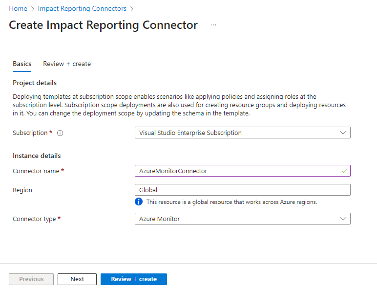
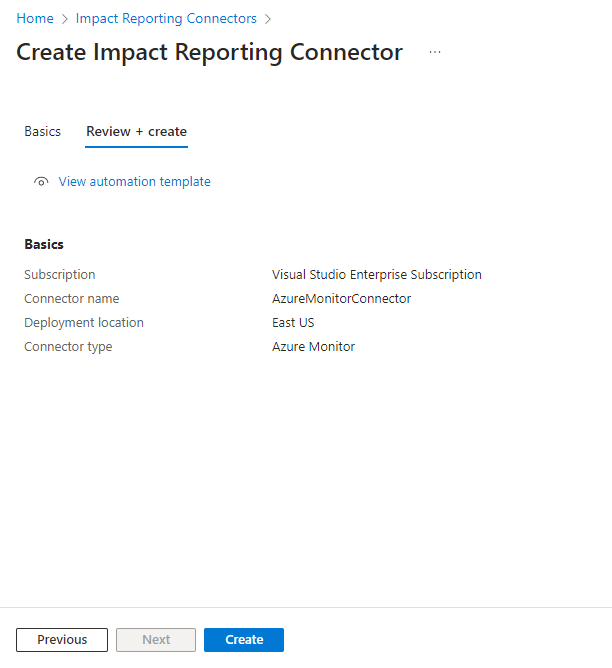
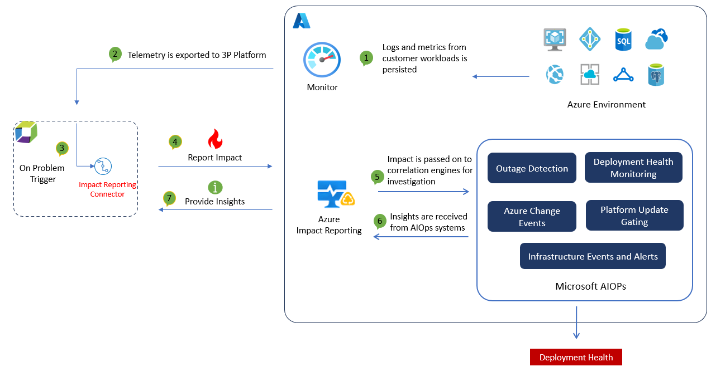

# Azure Impact Reporting - Documentation

### [Overview](#what-is-azure-impact-reporting)
[What is Azure Impact Reporting?](#what-is-azure-impact-reporting) <br>
[Impact Reporting Connectors for Azure Monitor](#impact-reporting-connectors-for-azure-monitor) <br>
[Impact Reporting Connectors for Dynatrace](#impact-reporting-dynatrace-connector) <br>
[Impact Reporting Connectors - FAQ](#azure-impact-reporting-connectors-for-azure-monitor-faq)

### [Tutorials](#register-for-private-preview)
[Register for Private Preview](#register-for-private-preview) <br>
[Report Impact on an Azure Virtual Machine](#report-impact-on-an-azure-virtual-machine) <br>
[Onboard to Azure Impact Reporting](#onboard-to-azure-impact-reporting) <!-- Might not be needed  --><br>
[Report Using a Logic App](#report-using-a-logic-app) <br>
[View Allowed Impact Categories](#view-allowed-impact-categories)

### [Troubleshoot]()
[Impact Reporting Connectors TSG](#impact-reporting-connectors-tsg)


## What is Azure Impact Reporting

Azure Impact Reporting enables you to report issues with performance, connectivity, and availability impacting your Azure workloads directly to Microsoft. It is an additional tool you can leverage and a quicker way to let us know that something might be wrong. These reports are used by Azure internal systems to aid in quality improvements and regression detection.

### What is an "Impact"?

In this context, an impact is any unexpected behavior or issue negatively affecting your workloads that has been root caused to the Azure platform.

Examples of impacts include:

* Performance Impact: Your application's performance degrades suddenly, you investigate and realize that database writes to your IaaS SQL virtual machine are unusually slow.
* Connectivity Impact: You're not able to successfully write to blob store despite having the right permissions
* Availability: Your Azure virtual machine unexpectedly reboots


Back to: 
[[top](#azure-impact-reporting---documentation)]
[[section](#overview)]
## Impact Reporting Connectors for Azure Monitor
The impact Connector for Azure Monitor alerts enables you to seamlessly report impact from an alert into Microsoft AIOps for change event correlation.

### How Connectors work


When you create a connector, it is associated with a subscription. When alerts whose target resource reside in the specified subscription get fired, an Impact report is created through Azure Impact Reporting and sent to Microsoft AIOPs.

### Create an Impact Connector for Azure Monitor Alerts

Below are steps needed to create an impact Connector for Azure Monitor Alerts

#### Pre-Requisites

| Type     | Details      |
| ------------- | ------------- |
| **Contributor Permissions** | Needed at the subscription scope for executing steps related to: <li>Resource provider registration</li><li>Enable Connector preview feature</li><li>Create the Impact Connector resource</li> |
| **User Access Administrator Permissions** | Needed at the subscription scope for executing steps related to: <li>Creating the custom role that enables the Connector to read alerts</li><li>Assigning the custom role to the Connector service</li> |
| **Command line tools** | [Bash](https://learn.microsoft.com/en-us/cli/azure/install-azure-cli) or [Powershell](https://learn.microsoft.com/en-us/powershell/azure/install-azure-powershell?view=azps-12.0.0) (*not needed if you are using CloudShell*)|
| **Subscription Id**| A subscription ID, or a file containing a list of subscription IDs  whose alerts are of interest|

#### Create a Connector - Command Line

The deployment scripts does the following:
* Registers your subscription(s) for Azure Impact Reporting private preview (pre-requisite for using Connectors)
* Creates a connector resource (`microsoft.impact/connector`)
* This connector will report an impact whenever an alert from those subscriptions fires

##### 1. **Get the script**
Go to the [Impact Reporting samples](https://github.com/Azure/impact-reporting-samples/tree/main/Onboarding/Connector/Scripts) githup repo and choose your script and choose either the bash or powershell script
##### 2. **Execute in your environment**
You will need to execute this script in your Azure environment.

###### **Powershell**
* Single Subscription: `./CreateImpactReportingConnector.ps1 -SubscriptionId <subid>`
* Multiple subscriptions from file: `./CreateImpactReportingConnector.ps1 -FilePath './subscription_ids'`

###### **Bash**
* Single Subscription: `./create-impact-reporting-connector.sh --subscription-id <subid>`
* Multiple subscriptions from file: `./create-impact-reporting-connector.sh --file_path './subscription_ids'

Back to: 
[[top](#azure-impact-reporting---documentation)]
[[section](#overview)]

#### Create a Connector - Azure Portal
Follow the steps below to create a Connector from the Azure Portal.

1. Search for **Impact Reporting Connectors** in Azure portal search
2. Click on the **Create** button on the left side in the page. The **Create Impact Reporting Connector** page opens

    

3. From the **Subscription** drop down select the subscription where the Connector will be created
4. Under **Instance details**, enter *AzureMonitorConnector* for the **Connector name** and choose *AzureMonitor* for the **Connector type**.
5. Select the **Review + create** button at the bottom of the page
6. Once the validations have passed, and the **Review + Create** shows no error, click on **Create** at the bottom of the page

    

7. The deployment can take several minutes to complete, as there are feature flags that need registration which can take some time to propagate. Meanwhile, head to the next section to enable alert reading from your subscription

Back to: 
[[top](#azure-impact-reporting---documentation)]
[[section](#troubleshoot)]

#### Assigning Azure-Alerts-Reader-Role to the Connector

1. Navigate to your subscription, and select **Access Control (IAM)** from the navigation blade
2. Click **Add** and then click **Add role assignment**. This will open the **Add role assignment** page. 
3. Under the **Role** tab, in the search bar, type *Azure-Alerts-Reader-Role*. If this role does not exist, head to [Creating the Azure-Alerts-Reader-Role](#creating-the-azure-alerts-reader-role) to create this role. Once the role is created, return back to this step.

    

4. Select the *Azure-Alerts-Reader-Role* and click on **Next** button at the bottom of the page
5. Under the **Members** tab, select **User, group, or service principal** for **Assign access to**.
6. Click on **Select members**, which will open the **Select Members** blade on the right side.
7. Enter **AzureImpactReportingConnector** in the search bar, and click on the AzureImpactReportingConnector application. Then click **Select** button.

    

8. Select the **Review + assign** button at the bottom of the page
9. In the **Review + assign** tab, click on **Review + assign** button at the bottom of the page

Back to: 
[[top](#azure-impact-reporting---documentation)]
[[section](#overview)]

#### Creating the Azure-Alerts-Reader-Role
1. Navigate to your subscription, and select **Access Control (IAM)** from the navigation blade
2. Click **Add** and then click **Add custom role**. This will open the **Create a custom role** page

    

3. Under the **Basics** tab, enter the name **Azure-Alerts-Reader-Role** for the **Custom role name**. Leave others as defaults and click on **Next** on the bottom of the page

    

4. Under the **Permissions** tab, click on **Add permissions**. On the right side, **Add permissions** blade will open

    

5. Enter *Microsoft.AlertsManagement/alerts/read* in the search bar

    

6. Select the tile **Microsoft.AlertsManagement**, which will take you to the **Microsoft.AlertsManagement permissions** blade. Select the permission: **Read: Read alerts**. Click on **Add**

    

7. Select the **Review + create** button at the bottom of the page
8. In the **Review + create** tab, click on **Create** button at the bottom of the page

Back to: 
[[top](#azure-impact-reporting---documentation)]
[[section](#overview)]


## Impact Reporting Dynatrace connector
This connector will allow Azure - Dynatrace customers to seemlessly send their problem - alerts from their Dynatrace tenant to Impact Reporting. In return, Azure Impact Reporting will provide valuable insights directly back to Dynatrace, accessible through their hub. This reciprocal exchange will empower users with deeper insights and a streamlined problem resolution process. 




Back to: 
[[top](#azure-impact-reporting---documentation)]
[[section](#impact-reporting-dynatrace-connector)]

### How it works
This integration is based on the Impact Reporting app that will be uploaded and installed in customer's Dynatrace environment. On onboarding, the user will need to provide the list of Azure subscriptions that they would want to report an impact against, on behalf of their Azure Entra App. To note, this a 1: N relation, which means, a single app ID can be used for multiple subscriptions.(details below on the onboarding script and installation). Once the customer successfully installs the app and onboards to our program, impacts would be sent to Impact Reporting using a secure pipeline. Impact Reporting would receive an impact whenever a problem is triggered by DavisAI in Dynatrace. On the creation of the problem, Impact Reporting App would fetch required details from GRAIL, translate the problem into an impact and report it to Impact Reporting by making an authenticated REST call to ARM using a token generated by app details provided by customers during onboarding.

Impact Reporting would consume these impacts reported by the app and feed it into multiple internal intelligent systems to correlate and provide insights back to the user. These insights will then be found on the users Dynatrace environment, by the home page of the app. 

Important: This feature is in Private Preview. Visit here to review terms: https://azure.microsoft.com/en-us/support/legal/preview-supplemental-terms/


Back to: 
[[top](#azure-impact-reporting---documentation)]
[[section](#impact-reporting-dynatrace-connector)]

### Onboarding Impact Reporting app and Upload to Dynatrace

Onboarding is a 4 step process. 
1) Upload and install the app in your Dynatrace environment.
2) Dynatrace Settings 
2) Run the Impact Reporting Onboarding Script 
3) Onboard to Dynatrace by completing worklow


#### 1. To Upload and install your app in Dynatrace: 
1) Please download the app binaries shared with you by Azure Impact Reporting team. 
2) The customer should log in to their preferred Dynatrace environment, open the Hub app, 
navigate to the Manage page, click the upload button, select the app artifact from the file picker, 
and confirm the installation. To complete this step, the user must have the app-engine:apps:install permission.

The app will require the following permissions from Dynatrace

    app-settings:objects:read - To read app settings that holds the tenant and credential information required to report impacts and fetch insights.
    app-settings:objects:write: To write to app settings values for tenant and credential information required to report impacts and fetch insights.
    environment-api:credentials:read: To read credential value that is used to get the access token for accessing the Microsoft APIs for reporting impacts and fetching insights.
    environment-api:credentials:write: To write to credential vault the credentials that are used to get an access token for accessing the Microsoft APIs for reporting impacts and fetching insights.
    automation:workflows:read: Read the created workflow that is used to report impacts.
    storage:entities:read: Read azure resource related information to report impact against.

As this app creates a workflow that triggers on a problem and does query execution using DQL to fetch additional details associated with a problem, there is a small cost incurred. Please review costing details here: [Rate Card](https://www.dynatrace.com/pricing/rate-card/)

#### 2. Dynatrace Settings: 
To make calls to AAD and ARM:    

    a) Go to Dynatrace Home --> Click Search on the left Panel  
    b) Search for 'Limit outbound connections' 
    c) Add the following to the list: 
        login.microsoftonline.com
        management.azure.com

#### 3. Impact Reporting Onboarding: 
Execute the onboarding script (provided to you by Impact Reporting), in your Azure environment.

#### Permissions Needed on Azure to run the deployment script:

Ensure you have Contributor permission in subscription(s) that you choose to onboard for Impact Reporting. You also need 'User Access Administrator or Role Based Access Administrator' permission to assign the 'Impact Reporter' and 'Monitoring Reader' role to the Entra App that will be used to report impacts from these subscriptions.

#### The deployment script does the following:
    a) Registers the resource provider Microsoft.Impact and associated feature flag for Impact Reporting within the customers' Azure subscription(s).
    b) Optionally, creates a third-party Azure Entra App with a secure secret to ensure pipeline security. 
    c) Grant the app the 'ImpactReporter' and 'Monitorig Reader' permissions on subscription(s).


#### 4. Onboard and complete workflow in Dynatrace : 
1) On completion of the above two steps. Return to the Dynatrace hub and open the Impact Reporting App that was uploaded in Step 1. 
2) Please input the Azure Tenant ID, Azure Entra App ID, Azure Entra App Secret.
3) Click to go to the Next page and click "Create Workflow".

Note: Once onboarded, this app creates some entries in app settings that are essential for a smooth execution. Customers are recommended to refrain from making changes to these app settings. Editing these app settings can hamper with app execution leading to unexpected results.

Note: It has been observed in some cases that, workflow execution fails with an error `InsufficientPermission: NOT_AUTHORIZED_FOR_TABLE`. If this error is seen, make the following changes to your settings in workflows app:

    a) In the Workflows app, at the top right corner, find Settings.
    b) Click on Settings and then Authorization Settings.
    c) Under Secondary permissions, select permissions for 'environment-api'
    d) Save changes and re-run the failed execution(s)
    


Back to: 
[[top](#azure-impact-reporting---documentation)]
[[section](#impact-reporting-dynatrace-connector)]


### Support/Questions/Comments: 
Please refer to the TSG or reach out to impactrp-preview@microsoft.com for any questions or feedback. 

Back to: 
[[top](#azure-impact-reporting---documentation)]
[[section](#impact-reporting-dynatrace-connector)]

## Azure Impact Reporting Connectors for Azure Monitor FAQ

### How do I enable debug mode?
* **Bash**: Uncomment the `set -x` at the beginning of the script to enable debug mode.
* **Powershell**: Change `Set-PSDebug -Trace 0 to Set-PSDebug -Trace 1` at the beginning of the script to enable debug mode

### What should I do if I encounter a permission error?

Verify your Azure role and permissions. You may need the help of your Azure administrator to grant you the necessary permissions or roles as defined in the permissions section.

### How can I verify if the connector is successfully created?
#### Option 1
* **Bash**:
    * Step 1: Run the below command: 
`az rest --method get --url https://management.azure.com/subscriptions/<subscription-id>/providers/Microsoft.Impact/connectors?api-version=2024-05-01-preview`
    * Step 2: You should see a resource with the name `AzureMonitorConnector`
* **Powershell**:
    * Step 1: Run the below command: 
`(Invoke-AzRestMethod -Method Get -Path subscriptions/<Subscription Id>/providers/Microsoft.Impact/connectors?api-version=2024-05-01-preview).Content`
`* Step 2: You should see a resource with the name `AzureMonitorConnector`

#### Option 2
* Step 1: From the Azure Portal, navigate to [Azure Resource Graph Explorer](https://portal.azure.com/#view/HubsExtension/ArgQueryBlade)
* Step 2: Run the below query: 
```kql
impactreportresources  | where name == "AzureMonitorConnector"  and type == "microsoft.impact/connectors"
```
* Step 3: The results should look like below, with a row for the connector resource

    

Back to: 
[[top](#azure-impact-reporting---documentation)]
[[section](#overview)]
## Register for Private Preview
Follow the steps below to register your subscription for Impact Reporting.

1. Navigate to your subscription
1. Under the `Settings` tab section, go to `Preview Features`
1. Under this tab, filter for `Microsoft.Impact` in the `type` section

1. Click on `Allow Impact Reporting` feature and register
1. After approval, please go to `Resource providers`, search for `Microsoft.Impact` and register

Once your request is approved, you will have the ability to report Impact to your Azure workloads.

[Report an Impact on a virtual machine](#report-impact-on-an-azure-virtual-machine) <br>
[Use a logic app as REST client for Impact Reporting ](#report-using-a-logic-app)

### Register your Subscription for Impact Reporting Feature - Script

To onboard multiple subscriptions, please use the following script.

> [!WARNING]
> Please note that the following script is offered with no guarantee from Microsoft.

```bash
#!/bin/bash

# List of your subscription IDs
SUBSCRIPTIONS=("sub_Id", "sub_Id2")

# Resource provider namespace to register, e.g., 'Microsoft.Compute'
PROVIDER_NAMESPACE="Microsoft.Impact"

# Feature name
FEATURE_NAME="AllowImpactReporting"

# AppId/MI id that needs "Impact Reporter" role
APP_ID="app_Id"

# role name that's used to grant access to appId/MI to be able to report impacts
ROLE_NAME="Impact Reporter"

# Loop through each subscription
for SUBSCRIPTION_ID in "${SUBSCRIPTIONS[@]}"
do
    # Select the subscription
    az account set --subscription "$SUBSCRIPTION_ID"

    # register resource provider
    az provider register --namespace "$PROVIDER_NAMESPACE" --wait

    # register preview feature
    az feature register --namespace "$PROVIDER_NAMESPACE" --name "$FEATURE_NAME"
   
    # Grant the role to the app ID or managed identity
    az role assignment create --assignee "$APP_ID" --role "$ROLE_NAME"	

    echo "Registered $PROVIDER_NAMESPACE in $SUBSCRIPTION_ID"
done
```

#### [HPC] Register your Subscription for Impact Reporting Feature - Script

> [!IMPORTANT]
> The following script is intended to be used for HPC Guest Health Reporting scenario customers.

> [!WARNING]
> Please note that the following script is offered with no guarantee from Microsoft.

```bash
#!/bin/bash

# List of your subscription IDs
SUBSCRIPTIONS=("sub_Id1")

# Resource provider namespace to register, e.g., 'Microsoft.Compute'
PROVIDER_NAMESPACE="Microsoft.Impact"

# Feature name
FEATURE_NAME="AllowImpactReporting"

# HPC Feature name
HPC_FEATURE_NAME="AllowHPCImpactReporting"

# AppId/MI id that needs impact reporter role
APP_ID="app_Id"

# role name that's used to grant access to appId/MI to be able to report impacts
ROLE_NAME="Impact Reporter"

# Loop through each subscription
for SUBSCRIPTION_ID in "${SUBSCRIPTIONS[@]}"
do
    # Select the subscription
    az account set --subscription "$SUBSCRIPTION_ID"

    # register resource provider
    az provider register --namespace "$PROVIDER_NAMESPACE" --wait

    # register preview feature
    az feature register --namespace "$PROVIDER_NAMESPACE" --name "$FEATURE_NAME"

    # register preview feature
    az feature register --namespace "$PROVIDER_NAMESPACE" --name "$HPC_FEATURE_NAME"
   
    # Grant the role to the app ID or managed identity
    az role assignment create --assignee "$APP_ID" --role "$ROLE_NAME"	

    echo "Registered $PROVIDER_NAMESPACE in $SUBSCRIPTION_ID"
done
```


Back to: 
[[top](#azure-impact-reporting---documentation)]
[[section](#overview)]

## Report Impact on an Azure Virtual Machine

> [!NOTE]
> Since most workloads have monitoring in place to detect failures, we recommend creating an integration through a logic app or Azure Function to file an impact report when your monitoring identifies a problem that you think is caused by the infrastructure.
>

### Report Impact via Azure REST API

Please review our full [REST API reference](https://aka.ms/ImpactRP/APIDocs) for more examples.

```json
{
  "properties": {
    "impactedResourceId": "/subscriptions/<Subscription_id>/resourcegroups/<rg_name>/providers/Microsoft.Compute/virtualMachines/<vm_name>",
    "startDateTime": "2022-11-03T04:03:46.6517821Z",
    "endDateTime": null, //or a valid timestamp if present
    "impactCategory": "Resource.Availability", //valid impact category needed
    "workload": { "name": "webapp/scenario1" }
  }
}
```

```rest
az rest --method PUT --url "https://management.azure.com/subscriptions/<Subscription_id>/providers/Microsoft.Impact/workloadImpacts/<impact_name>?api-version=2022-11-01-preview"  --body <body_above>

```

### Report Impact via Azure Portal

--coming soon: file an impact report via azcli and Azure portal.

<!-- ## Reporting Impact via Azure CLI -->


Back to: 
[[top](#azure-impact-reporting---documentation)]
[[section](#tutorials)]
## Onboard to Azure Impact Reporting
> [!NOTE]
> Please visit the [API Docs](https://aka.ms/ImpactRP/APIDocs) to learn more about available impact management actions.


### Register your Subscription for Impact Reporting Feature
> [!NOTE]
> Please contact us at `impactrp-preview@microsoft.com` for any questions.

Follow the steps below to register your subscription for Impact Reporting.

1. Navigate to your subscription
1. Under the `Settings` tab section, go to `Preview Features`
1. Under this tab, filter for `Microsoft.Impact` in the `type` section

1. Click on `Allow Impact Reporting` feature and register
1. After approval, please go to `Resource providers`, search for `Microsoft.Impact` and register

Once your request is approved, you will have the ability to report Impact to your Azure workloads.

### Report Using Managed Identity

#### Grant Required Permissions

The principal reporting impacts needs to have the `Impact Reporter` Azure built-in role at the tenant, subscription, resource group, or resource level. This role provides the following actions:

```text
"Microsoft.Impact/WorkloadImpacts/*",
```

### Report Using curl or Powershell

Below are some examples on how you may report impact from the cli.
Please note that in this case the user reporting impact needs to have the `Impact Reporter` Azure resource role assigned at the right scope.

#### [Powershell](#tab/powershell/)

```powershell

# Log in first with Connect-AzAccount if not using Cloud Shell

$azContext = Get-AzContext
$azProfile = [Microsoft.Azure.Commands.Common.Authentication.Abstractions.AzureRmProfileProvider]::Instance.Profile
$profileClient = New-Object -TypeName Microsoft.Azure.Commands.ResourceManager.Common.RMProfileClient -ArgumentList ($azProfile)
$token = $profileClient.AcquireAccessToken($azContext.Subscription.TenantId)
$authHeader = @{
    'Content-Type'='application/json'
    'Authorization'='Bearer ' + $token.AccessToken
}
$body = @"
{
  `"properties`": {
    `"impactedResourceId`": `"/subscriptions/00000000-0000-0000-0000-000000000000/resourceGroups/resource-rg/providers/Microsoft.Sql/sqlserver/dbservercontext`",
    `"startDateTime`": `"2022-06-15T05:59:46.6517821Z`",
    `"endDateTime`": null,
    `"impactDescription`": `"high cpu utilization`",
    `"impactCategory`": `"Resource.Performance`",
    `"workload`": {
      `"context`": `"webapp/scenario1`",
      `"toolset`": `"Other`"
    },
    `"performance`": [
      {
        `"metricName`": `"CPU`",
        `"actual`": 90,
        `"expected`": 60
      }
    ]
  }
}
"@


# Invoke the REST API
$restUri = 'https://management.azure.com/subscriptions/00000000-0000-0000-0000-000000000000/providers/Microsoft.Impact/workloadImpacts/<impact_name>?api-version=2023-02-01-preview'
$response = Invoke-RestMethod -Uri $restUri -Method Put -Body $body -Headers $authHeader
```

#### [cURL](#tab/curl/)

```curl
curl --location 'https://management.azure.com/subscriptions/00000000-0000-0000-0000-000000000000/providers/Microsoft.Impact/workloadImpacts/impact-002?api-version=2023-02-01-preview' \
--header 'response-v1: true' \
--header 'Content-Type: application/json' \
--data '{
  "properties": {
    "impactedResourceId": "/subscriptions/00000000-0000-0000-0000-000000000000/resourceGroups/resource-rg/providers/Microsoft.Sql/sqlserver/dbservercontext",
    "startDateTime": "2022-06-15T05:59:46.6517821Z",
    "endDateTime": null,
    "impactDescription": "high cpu utilization",
    "impactCategory": "Resource.Performance",
    "workload": {
      "context": "webapp/scenario1",
      "toolset": "Other"
    },
    "performance": [
      {
        "metricName": "CPU",
        "actual": 90,
        "expected": 60
      }
    ]
  }
}'
```

---

### Payload Examples

#### [Connectivity](#tab/connectivity/)

```json
PUT https://management.azure.com/subscriptions/00000000-0000-0000-0000-000000000000/providers/Microsoft.Impact/workloadImpacts/impact-001?api-version=2022-11-01-preview

{
  "properties": {
    "impactedResourceId": "/subscriptions/00000000-0000-0000-0000-000000000000/resourceGroups/resourceSub/providers/Microsoft.sql/sqlservers/db1",
    "startDateTime": "2022-06-15T05:59:46.6517821Z",
    "endDateTime": null,
    "impactDescription": "conection failure",
    "impactCategory": "Resource.Connectivity",
    "connectivity": {
      "protocol": "TCP",
      "port": 1443,
      "source": {
        "azureResourceId": "/subscriptions/00000000-0000-0000-0000-000000000000/resourceGroups/resourceSub/providers/Microsoft.compute/virtualmachines/vm1"
      },
      "destination": {
        "uri": "https://www.microsoft.com"
      }
    },
    "workload": {
      "context": "webapp/scenario1",
      "toolset": "Other"
    }
  }
}
```

#### [Performance]((#tab/performance/))

```json
PUT https://management.azure.com/subscriptions/00000000-0000-0000-0000-000000000000/providers/Microsoft.Impact/workloadImpacts/impact-002?api-version=2022-11-01-preview

{
  "properties": {
    "impactedResourceId": "/subscriptions/00000000-0000-0000-0000-000000000000/resourceGroups/resource-rg/providers/Microsoft.Sql/sqlserver/dbservercontext",
    "startDateTime": "2022-06-15T05:59:46.6517821Z",
    "endDateTime": null,
    "impactDescription": "high cpu utilization",
    "impactCategory": "Resource.Performance",
    "workload": {
      "context": "webapp/scenario1",
      "toolset": "Other"
    },
    "performance": [
      {
        "metricName": "CPU",
        "actual": 90,
        "expected": 60
      }
    ]
  }
}
```
Back to: 
[[top](#azure-impact-reporting---documentation)]
[[section](#tutorials)]

## Report Using a Logic App

>[!TIP]
> Please visit the [API Docs](https://aka.ms/ImpactRP/APIDocs) to learn more about available impact management actions.


### Prerequisites

Please first see [Onboarding](#register-for-private-preview) for steps on enabling private preview API access for your subscription.\
\
A managed identity with PUT access to the ImpactRP API and read access to the data source for the workload is required. Additionally, a query with a 1 minute or greater polling interval for the data source to generate the following fields is needed:

- ImpactName
- ImpactStartTime
- ImpactedResourceId
- WorkloadContext
- ImpactCategory

This guide will use a Kusto cluster as an example data source with the following query:

```kusto
ExampleTable
| where Status =~ "BAD" and ingestion_time() > ago(1m)
| distinct  ImpactStartTime=TimeStamp, ImpactedResourceId=ResourceId, WorkloadContext=Feature, ImpactCategory="Resource.Availability", ImpactName = hash_sha1(strcat(TimeStamp, ResourceId , Feature, Computer, ingestion_time()))
```
> [!NOTE]
> Please replace the above query with a query to a datastore or source that is supported by Logic Apps that returns the same columns. If all of these columns are not readily available, additional steps must be added to the workflow to generate the missing fields.

### Steps

1. Create a new Logic Apps in Azure Portal with the following settings:
    - Publish: Workflow
    - Region: Central US
    - Plan: Standard

2. (Optional) Under the "Monitoring" section, set "Enable Application Insights" to "Yes". This will allow for failure monitoring. Additional steps will be at the bottom of this document.

3. Review and Create the Logic App. Once created, open the Logic App and navigate to "Settings" -> "Identity" in the side pane. In the "User assigned" section, click "Add" and select the managed identity created in the prerequisites. Click "Save" to save the changes.

4. Navigate to "Workflows" -> "Connections" and click on the "JSON View" tab. Create a connection for your data source. The following is an example for Kusto with managed identity, but any data source supported by Logic Apps can be used:

    ```json
    {
        "managedApiConnections": {
            "kusto": {
                "api": {
                    "id": "/subscriptions/<subscription_id>/providers/Microsoft.Web/locations/<region>/managedApis/kusto"
                },
                "authentication": {
                    "type": "ManagedServiceIdentity"
                },
                "connection": {
                    "id": "/subscriptions/<subscription_id>/resourceGroups/<rg_name/providers/Microsoft.Web/connections/<connection_name>"
                },
                "connectionProperties": {
                    "authentication": {
                        "audience": "https://kusto.kustomfa.windows.net",
                        "identity": "/subscriptions/<subscription_id>/resourcegroups/<rg_name>/providers/Microsoft.ManagedIdentity/userAssignedIdentities/<managed_identity_name>",
                        "type": "ManagedServiceIdentity"
                    }
                },
                "connectionRuntimeUrl": "<kusto_connection_runtime_url>"
            }
        }
    }
    ```

    Click "Save" to save the changes.

5. Navigate to "Workflows" -> "Workflows". Click "Add" and create and new blank workflow with "State Type" set as "Stateful".

6. Click on the newly created workflow. Navigate to to "Developer" -> "Code" and replace the contents of the JSON with the following:

    ```json
    {
        "definition": {
            "$schema": "https://schema.management.azure.com/providers/Microsoft.Logic/schemas/2016-06-01/workflowdefinition.json#",
            "actions": {
                "For_each": {
                    "actions": {
                        "HTTP": {
                            "inputs": {
                                "authentication": {
                                    "identity": "/subscriptions/<subscription_id>/resourcegroups/<rg_name>/providers/Microsoft.ManagedIdentity/userAssignedIdentities/<managed_identity_name>",,
                                    "type": "ManagedServiceIdentity"
                                },
                                "body": {
                                    "properties": {
                                        "endDateTime": null,
                                        "impactCategory": "@{items('For_each')?['ImpactCategory']}",
                                        "impactedResourceId": "@{items('For_each')?['ImpactedResourceId']}",
                                        "startDateTime": "@{items('For_each')?['ImpactStartTime']}",
                                        "workload": {
                                            "context": "@{items('For_each')?['WorkloadContext']}"
                                        }
                                    }
                                },
                                "method": "PUT",
                                "retryPolicy": {
                                    "count": 5,
                                    "interval": "PT30M",
                                    "maximumInterval": "PT24H",
                                    "minimumInterval": "PT30M",
                                    "type": "exponential"
                                },
                                "uri": "@{concat('https://management.azure.com/subscriptions/', split(item().ImpactedResourceId, '/')[2], '/providers/Microsoft.Impact/workloadImpacts/', item().ImpactName, '?api-version=2022-11-01-preview')}"
                            },
                            "runAfter": {},
                            "type": "Http"
                        }
                    },
                    "foreach": "@body('Run_KQL_query')?['value']",
                    "runAfter": {
                        "Run_KQL_query": [
                            "Succeeded"
                        ]
                    },
                    "type": "Foreach"
                },
                "Run_KQL_query": {
                    "inputs": {
                        "body": {
                            "cluster": "https://examplecluster.eastus.kusto.windows.net/",
                            "csl": "ExampleTable\n|where Status =~ \"BAD\" and ingestion_time()>ago(1m)\n|distinct  ImpactStartTime=TimeStamp, ImpactedResourceId=ResourceId, WorkloadContext=Feature, ImpactCategory=\"Resource.Availability\", ImpactName = hash_sha1(strcat(TimeStamp, ResourceId , Feature, Computer, ingestion_time()))",
                            "db": "exampledb"
                        },
                        "host": {
                            "connection": {
                                "referenceName": "kusto"
                            }
                        },
                        "method": "post",
                        "path": "/ListKustoResults/false"
                    },
                    "runAfter": {},
                    "type": "ApiConnection"
                }
            },
            "contentVersion": "1.0.0.0",
            "outputs": {},
            "triggers": {
                "Recurrence": {
                    "recurrence": {
                        "frequency": "Minute",
                        "interval": 1
                    },
                    "type": "Recurrence"
                }
            }
        },
        "kind": "Stateful"
    }
    ```

    Click "Save" to save the changes.

7. Navigate to "Developer" -> "Designer". Click on the "Run KQL Query" block. Replace "Cluster URL" and "Database" with the target Kusto cluster and database. Replace the "Query" with the query from the prerequisites. Next, click on the blue "Change connection" link underneath the query textbox. Set "Authentication" to Managed Identity and set "Managed identity" to the managed identity created in the prerequisites with an appropriate "Connection Name" and click "Create".

    > [!NOTE]
    > If using a source other than Kusto, replace the "Run KQL Query" block with the appropriate block for your data source. The "For Each" block will need to be updated to iterate over the results of the query and the "HTTP" block will need to be updated to use the appropriate data from the query results.

8. (Optional) If the polling interval for the query is greater than 1 minute, click on the "Recurrence" block and set the "Interval" to the polling interval in minutes.

9. Click on the "HTTP" block and update the "Authentication" to the managed identity created in the prerequisites. Click "Save" to save the changes.

10. Navigate to "Overview" and click "Run" to test the flow. Results will be displated under "Run History".

11. (Optional) Return to the Logic App screen in Azure Portal. Navigate to "Settings" -> "Application Insights" and click on the hyperlink to the Application Insights resource. Navigate to "Monitoring" -> "Alerts". Click "Create" -> "Alert Rule". From here, you can create an alert rule to notify on failures.


Back to: 
[[top](#azure-impact-reporting---documentation)]
[[section](#tutorials)]
## View Allowed Impact Categories
> All Azure resource types are currently supported for impact reporting.

Please review our full list of categories in our [REST API reference](https://aka.ms/ImpactRP/APIDocs).

### Category list

|**Category Name**|**Problem Description**|
|----------------------------------|------------------------------------------------------------------------------------------------------------------------|
|ARMOperation.CreateOrUpdate|Use this to report problems related to creating a new azure virtual machines such as provisioning or allocation failures|
|ARMOperation.Delete|Use this to report failures in deleting a resource.|
|ARMOperation.Get|Use this to report failures in querying resource metadata.|
|ARMOperation.Start|Use this to report failures in starting a resource.|
|ARMOperation.Stop|Use this to report failures in stopping a resource.|
|ARMOperation.Other|Use this to report Control Plane operation failures that don’t fall into other ARMOperation categories.|
|Resource.Performance|Use this to report general performance issues. For example, as high usage of CPU, IOPs, disk space, or memory|
|Resource.Performance.Network|Use this to report performance issues which are networking related. For example, degraded network throughput.|
|Resource.Performance.Disk|Use this to report performance issues which are disk related. For example, degraded IOPs|
|Resource.Performance.CPU|Use this to report performance issues which are CPU related.|
|Resource.Performance.Other|Use this to report issues that don’t fall under other Resource.Performance sub-categories.|
|Resource.Connectivity|Use this to report general connectivity issues to or from a resource.|
|Resource.Connectivity.Inbound|Use this to report inbound connectivity issues to a resource.|
|Resource.Connectivity.Outbound|Use this to report outbound connectivity issues from a resource.|
|Resource.Connectivity.Other|Use this to report issues that don’t fall into under other Resource.Connectivity sub-categories|
|Resource.Availability|Use this to report general unavailability issues|
|Resource.Availability.Restart|Use this to report if an unexpected virtual machine restarts|
|Resource.Availability.Boot|Use this to report virtual machines which are in a non-bootable state, not booting at all or is on a reboot loop|
|Resource.Availability.Disk|Use this to report availability issues related to disk|
|Resource.Availability.UnResponsive|Use this to report a resource that is not responsive now or for a period of time in the past|
|Resource.Availability.Storage|Use this to report availability issues related to storage.|
|Resource.Availability.Network|Use this to report network availability issues.|
|Resource.Availability.DNS|Use this to report DNS availability issues.|
|Resource.Availability.Other|Use this to report issues that don’t fall into under other Resource.Availability sub-categories|


Back to: 
[[top](#azure-impact-reporting---documentation)]
[[section](#tutorials)]
## Impact Reporting Connectors TSG
#### The bash script fails immediately after starting
Ensure that the script has execution permissions. Use the below command to make it executable.
chmod `+x create-impact-reporting-connector.sh`

#### In the bash script, azure login fails (az login command not working)
Ensure [Azure CLI](https://learn.microsoft.com/en-us/cli/azure/install-azure-cli) is installed and updated to the latest version. Try manually logging in using `az login` to check for any additional prompts or errors.

#### Error "**Subscription ID or file path with list of subscription IDs required**"
- **Bash**: Make sure you are providing either `--subscription-id` or `--file-path` argument when executing the script. Do not provide both. <br>
- **Powershell**: Make sure to provide either the `-SubscriptionId` parameter or the  `-FilePath` parameter when invoking the script. Do not provide both.

#### Error "**Failed to find file: [file_path]**"
- **Bash**: Verify the file path provided with `--file-path` exists and is accessible. Ensure the correct path is used. <br>
- **Powershell**: Verify the file path provided with `-FilePath` exists and is accessible. Ensure the correct path is used and the file is not locked or in use by another process.

#### Script fails to execute with permission errors
Ensure you have Contributor permission to log in to Azure, register resource providers, and create connectors in the Azure subscriptions. You also need to have `User Access Administrator` permission to create and assign custom roles.

#### Script execution stops unexpectedly without completing
Check if the Azure PowerShell module is installed and up to date. Use `Update-Module -Name Az` to update the Azure PowerShell module. Ensure `$ErrorActionPreference` is set to `Continue` temporarily to bypass non-critical errors.

#### Namespace or feature registration takes too long or fails
These operations can take several minutes. Ensure your Azure account has the Contributor access on the subscription(s). Re-run the script once the required access has been provided. If the issue persists on re-running reach out to the [Impact Reporting connectors team](mailto:impactrp-preview@microsoft.com).

#### Custom role creation or assignment fails
1.	Ensure the Azure Service Principal `AzureImpactReportingConnector` exists by typing it into the Azure resource search box as shown below, if not wait for a few minutes for it to get created. If it does not get created even after an hour, reach out to the [Impact Reporting connectors team](mailto:impactrp-preview@microsoft.com).

    
2.	Verify your account has `User Access Administrator` permission to create roles and assign them.
#### Connector creation takes too long
It may take 15-20 minutes for the namespace registration to allow the connector resource creation to take place. 
If the script has not completed execution after 30 minutes, cancel the execution and re-run it. If this issue persists, reach out to the [Impact Reporting Connectors team](mailto:impactrp-preview@microsoft.com)

#### Connector creation fails

1. Ensure that the RPs: Microsoft.Impact is registered. You can do this in 2 ways -
    - From the Azure Portal, navigate to your `Subscription -> Resource Providers`

        
    - **Bash**: run `az provider show -n "Microsoft.Impact" -o json --query "registrationState"`
        
    - **PowerShell**: run `Get-AzResourceProvider -ProviderNamespace Microsoft.Impact`
        
2.	Ensure that the feature flags: AllowImpactReporting and `AzureImpactReportingConnector` are registered against the feature:` Microsoft.Impact` Run the below command

    - **Bash**
        - `az feature list -o json --query "[?contains(name, 'Microsoft.Impact/AllowImpactReporting')].{Name:name,State:properties.state}"`
        - `az feature list -o json --query "[?contains(name, 'Microsoft.Impact/AzureImpactReportingConnector')].{Name:name,State:properties.state}"` <br>
        
    - **PowerShell**
        - `Get-AzProviderFeature -ProviderNamespace "Microsoft.Impact" -FeatureName AzureImpactReportingConnector"`
        - `Get-AzProviderFeature -ProviderNamespace "Microsoft.Impact" -FeatureName AllowImpactReporting`
        
3.	Ensure that you have Contributor access to the subscription(s)

This covers the common scenarios encountered while onboarding the connector. For issues not covered here, reach out to the [Impact Reporting Connectors team](mailto:impactrp-preview@microsoft.com).

#### Connector deployment fails to due to permission errors

Ensure you have **Contributor** permission to log in to Azure, register resource providers, and create connectors in the Azure subscriptions.

#### Custom role assignment fails to due to permission errors

You also need to have [Owner](https://learn.microsoft.com/en-us/azure/role-based-access-control/built-in-roles#owner) or [User Access Administrator](https://learn.microsoft.com/en-us/azure/role-based-access-control/built-in-roles#user-access-administrator) role to create and assign custom roles.

#### Connector deployment fails with: The resource type could not be found in the namespace 'Microsoft.Impact' for api version '2024-05-01-preview'

Feature flag registration is required for connector to become available as a deployable resource. It can take about 15-20 minutes for this process to complete. Retry after 30 minutes and the connector deployment will succeed.

Back to:
[[top](#azure-impact-reporting---documentation)]
[[section](#troubleshoot)]
